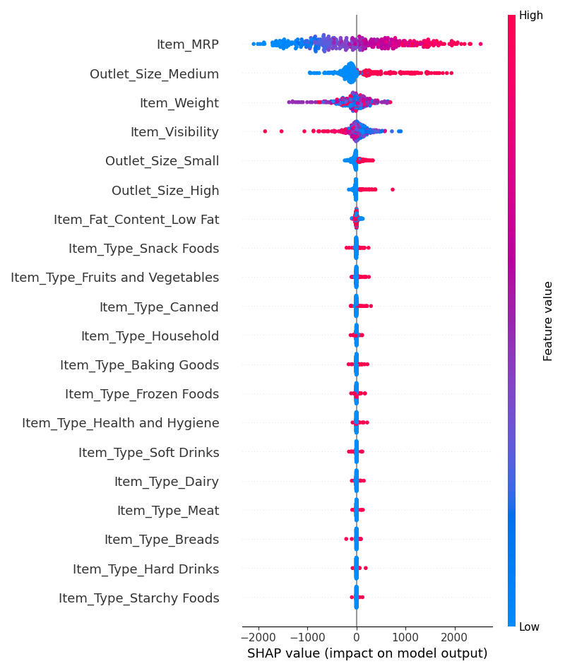
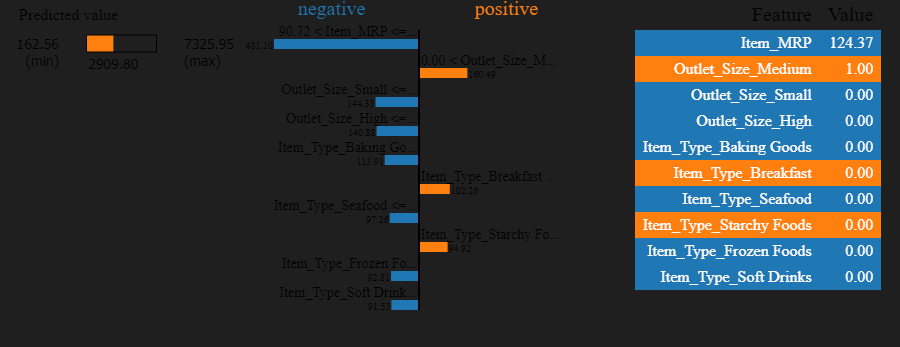

# Prediction-of-Product-Sales

#### Nicholas Rowland
------------------------------------------------------------
# Purpose
## The goal of these series of models is to identify success markers in our various locations and to improve by helping them understand the products and outlets that have a significant impact on increasing sales. Helping our locations understand the importance of these factors will be crucial in increasing sales to stimulate future growth of the company overall.

# This dataset will provide a sales prediction for various supermarkets

https://drive.google.com/file/d/1syH81TVrbBsdymLT_jl2JIf6IjPXtSQw/view?usp=sharing

# Data cleaning
To provide the most accurate data possible the data has been cleaned to remove all null/duplicated values for optimal performance

# Exploratory Data Visualization
Visualized data in the form of graphs and plots to demonstrate correlation the following plots were used:
- Bar plot
- Box Plot
- Scatter plot

#### The plot above displays that the 3 most commonly sold items from our supermarkets are fruits/vegetables, household goods, and snack foods

#### The plot above shows us that tier 3 stores perform better than either tier 1 or tier 2 locations

#### The plot above demonstrates a positive correlation between the sales of our quality branded products rather than our economically cost effective products

# Machine Learning Models Used:
- Linear Regression
- Random Forest Regression
- Tuned Random Forest Regression (Best Parameters used)

### Linear Regression Model
- Regression Metrics: Test Data
------------------------------------------------------------
- MAE = 994.970
- MSE = 1,737,439.721
- RMSE = 1,318.120
- R^2 = 0.370

### Random Forest Model
- Regression Metrics: Test Data
------------------------------------------------------------
- MAE = 891.347
- MSE = 1,517,274.032
- RMSE = 1,231.777
- R^2 = 0.450

### Tuned Random Forest Model
Regression Metrics: Test Data
------------------------------------------------------------
- MAE = 847.955
- MSE = 1,370,115.384
- RMSE = 1,170.519
- R^2 = 0.503

Among the regression models used, we would definitely implement the tuned random forest model. However, a regression model to make predictions for this dataset would be fairly unreliable. The R^2 score is especially important to us as it displays an accuracy value of only 50% after tuning. The RMSE score is also a little on the higher side for an error score related to our target.

# Final Recommendations
While the model was somewhat unreliable the data visualizations we do have display trends that may not say everything we need but definitely do tell a story. We would just need to find more correlating values and maybe some more data to further tune and return a more accurate model 

# Prediction of product sales revisited

# interpret the top 3 most important features and how they influence your model's predictions
##     item_mrp:
###     the dot plot display a greater concentration(red dots) to the right meaning that higher values of this will increase an item's sales

##     outlet_size_medium:
###     the higher positive concentration of medium size stores(red dots) will issue a positive impact to our prediction result
##     item_weight:
###     a central cluster of our values with mixed features(purple dots) is indicative of a(n) average/typical impact on the model predictions.

# Local Explanations

### Here we can see the force plot demonstrates that a higher MRP, can be the largest contributing factor to decreases in sales while the outlet_size_medium provides the largest increase to sales. A higher point to filter Item_MRP from would probably increase the predictability

### The lime explaination shows a lot of the same featuring our Item_MRP overwhelmingly giving negative contributions while outlet_size_medium excels in assisting sales predicability

### Our higher filter point worked! This force plot shows largely postive contributing factors across the board, the small outlet size has shown itself to give our most noteworthy contribution to a decrease in sales predictability. Possibly will need more data specifically from small outlets

### Our lime explainer displays a heavy negative influence from our Item_Type_Breakfast, with a strong positive influnce from our Item_MRP filter point increase.